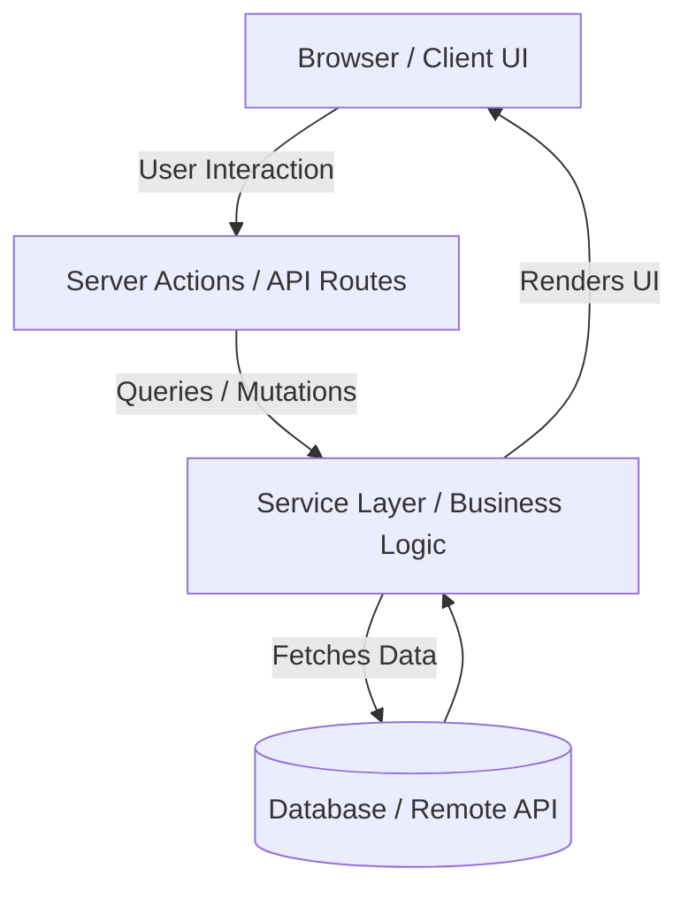

# Architecture Overview

This document provides a high-level overview of the architecture, design principles, and component boundaries of **GefenStarlight**.

---

## 🏗️ Architectural Vision

GefenStarlight is built on modern web paradigms using **Next.js (App Router)**, **React Server Components**, and standard **Vanilla CSS** tokens.

### Key Architectural Pillars
1. **Server-First by Default**: Leverage Next.js App Router server components for high performance, optimal SEO, and reduced client JavaScript payload.
2. **Design Tokens & Modular CSS**: Style using Vanilla CSS modules and root variables for customizability without external CSS framework bloat.
3. **Strict Type Safety**: Full TypeScript integration across components, utility modules, and API handlers.
4. **Decoupled Business Logic**: Separation of concerns between UI components, state managers, and backend API routes.

---

## 📁 Directory Architecture

```text
gefenstarlight/
├── src/
│   ├── app/                 # Next.js App Router pages, layouts, and API routes
│   │   ├── favicon.ico
│   │   ├── globals.css      # Design system variables & base styles
│   │   ├── layout.tsx       # Root application layout
│   │   └── page.tsx         # Primary application entry page
│   ├── components/          # Reusable UI components
│   └── lib/                 # Utility functions and core business logic
├── public/                  # Static assets (images, fonts, icons)
├── .agents/                 # AI assistant workspace guidelines
├── run.bat                  # Local execution helper script
└── package.json             # Dependencies and build scripts
```

---

## 🔄 Data Flow & State Management



---

## 🛡️ Best Practices & Conventions

- **Component Boundaries**: Keep `'use client'` directives localized strictly to interactive leaf components.
- **Styling**: Define global tokens in `src/app/globals.css`. Use CSS Modules (`*.module.css`) for component-specific styles.
- **Imports**: Use standard path aliases `@/*` mapping to `./src/*`.
